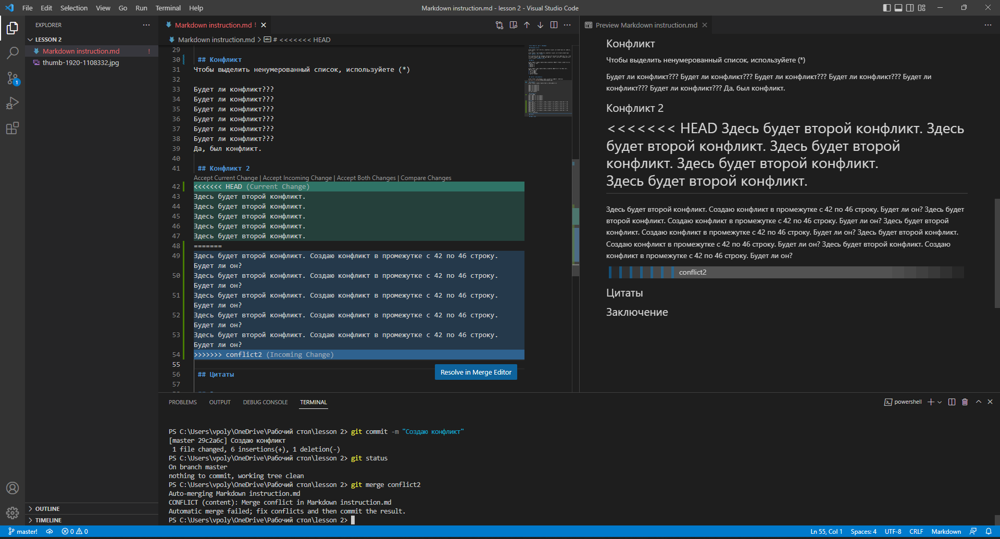

 # Инструкци для работы с Markdown

 ## Выделение текста

Чтобы выделить текст курсивом, необходимо обрамить его звездочками (*). Например, *вот так*.

Чтобы выделить текст полужирным, необходимо обрамить его двойными звездочками (**). Например, **вот так**

Альтернативные способы выделения текста жирным или курсовом нужны для того, чтобы мы могли совмещать оба эти способа. Например, _текст может быть выделен курсивом и при этои быть **полужирным**_.

 ## Списки 

Чтобы добавить ненумерованный списки необходимов пункты выделить звездочкой (*). Например, вот так:
* Элемент 1
* Элемент 2
* Элемент 3

Чтобы добавить нумерованные списки, необходимо пункты просто пронумеровать. Например вот так:
1. Первый пункт
2. Второй пункт
3. Третий пункт
4. Четвертый пункт

 ## Работа с изображениями

Чтобы вставить изображение в текст, достаточно написать следующее: 

 ## Конфликт
Чтобы выделить ненумерованный список, используйете (*)

Будет ли конфликт???
Будет ли конфликт???
Будет ли конфликт???
Будет ли конфликт???
Будет ли конфликт???
Будет ли конфликт???
Да, был конфликт.

 ## Конфликт 2
Здесь будет второй конфликт. Создаю конфликт в промежутке с 42 по 46 строку. Будет ли он? 
Здесь будет второй конфликт. Создаю конфликт в промежутке с 42 по 46 строку. Будет ли он? 
Здесь будет второй конфликт. Создаю конфликт в промежутке с 42 по 46 строку. Будет ли он? 
Здесь будет второй конфликт. Создаю конфликт в промежутке с 42 по 46 строку. Будет ли он? 
Здесь будет второй конфликт. Создаю конфликт в промежутке с 42 по 46 строку. Будет ли он? 
 Да. Был.
 ## Изображение скрина конфликта

 ## Добавление информации про удаленный репозиторий
 
Для того, чтобы внести вклад в какой-либо Git-проект, вам необходимо уметь работать с удалёнными репозиториями. Удалённые репозитории представляют собой версии вашего проекта, сохранённые в интернете или ещё где-то в сети. У вас может быть несколько удалённых репозиториев, каждый из которых может быть доступен для чтения или для чтения-записи. Взаимодействие с другими пользователями предполагает управление удалёнными репозиториями, а также отправку и получение данных из них. Управление репозиториями включает в себя как умение добавлять новые, так и умение удалять устаревшие репозитории, а также умение управлять различными удалёнными ветками, объявлять их отслеживаемыми или нет и так далее. В данном разделе мы рассмотрим некоторые из этих навыков.
Вполне возможно, что удалённый репозиторий будет находиться на том же компьютере, на котором работаете вы. Слово «удалённый» не означает, что репозиторий обязательно должен быть где-то в сети или Интернет, а значит только — где-то ещё. Работа с таким удалённым репозиторием подразумевает выполнение стандартных операций отправки и получения, как и с любым другим удалённым репозиторием.

Для того, чтобы просмотреть список настроенных удалённых репозиториев, вы можете запустить команду git remote. Она выведет названия доступных удалённых репозиториев. Если вы клонировали репозиторий, то увидите как минимум origin — имя по умолчанию, которое Git даёт серверу, с которого производилось клонированию
Для того, чтобы добавить удалённый репозиторий и присвоить ему имя (shortname), просто выполните команду git remote add <shortname> <url>
Когда вы клонируете репозиторий, команда clone автоматически добавляет этот удалённый репозиторий под именем «origin». Таким образом, git fetch origin извлекает все наработки, отправленные на этот сервер после того, как вы его клонировали (или получили изменения с помощью fetch). Важно отметить, что команда git fetch забирает данные в ваш локальный репозиторий, но не сливает их с какими-либо вашими наработками и не модифицирует то, над чем вы работаете в данный момент. Вам необходимо вручную слить эти данные с вашими, когда вы будете готовы.
Если ветка настроена на отслеживание удалённой ветки (см. следующий раздел и главу Ветвление в Git чтобы получить больше информации), то вы можете использовать команду git pull чтобы автоматически получить изменения из удалённой ветки и слить их со своей текущей. Этот способ может для вас оказаться более простым или более удобным. К тому же, по умолчанию команда git clone автоматически настраивает вашу локальную ветку master на отслеживание удалённой ветки master на сервере, с которого вы клонировали репозиторий. Название веток может быть другим и зависит от ветки по умолчанию на сервере. Выполнение git pull, как правило, извлекает (fetch) данные с сервера, с которого вы изначально клонировали, и автоматически пытается слить (merge) их с кодом, над которым вы в данный момент работаете.
Когда вы хотите поделиться своими наработками, вам необходимо отправить их в удалённый репозиторий. Команда для этого действия простая: git push <remote-name> <branch-name>. Чтобы отправить вашу ветку master на сервер origin (повторимся, что клонирование обычно настраивает оба этих имени автоматически), вы можете выполнить следующую команду для отправки ваших коммитов.Эта команда срабатывает только в случае, если вы клонировали с сервера, на котором у вас есть права на запись, и если никто другой с тех пор не выполнял команду push. Если вы и кто-то ещё одновременно клонируете, затем он выполняет команду push, а после него выполнить команду push попытаетесь вы, то ваш push точно будет отклонён. Вам придётся сначала получить изменения и объединить их с вашими и только после этого вам будет позволено выполнить push
Если хотите получить побольше информации об одном из удалённых репозиториев, вы можете использовать команду git remote show <remote>
Для переименования удалённого репозитория можно выполнить git remote rename.